<br />
<div align="center">
  <a href="#">
    
  </a>

<h1 align = "center">
<b><i>Xpensor</i></b>
</h1>

  <p align="center">
    A Local Expense Tracker for Android
    <br />
    <a href="#-screenshots-">Screenshots</a>
    ·
    <a href="#-requirements-">Requirements</a>
    ·
    <a href="#-architecture-">Architecture</a>
    ·
     <a href="#-technologies-">Technologies</a>
    ·
    <a href="#-license-">License</a>
  </p>
</div>


Xpensor is a Local Expense Tracker App created in order to demonstrate the use of modern Android Development Practices, Android Architecture Components, Material Theming & Animations.

As of now, this project still has certain functionalities being worked on, althought its backbone is already set up.

## 🕹️ UI/UX 🕹️

This app provides a clean and simple Material-based Visual Feedback via Dialogs, Snackbars, Toasts and Bottom Sheets. It also enhances the user interfaces by providing visual cues to the user via animations, which are exaggerated to an extent, as this is an experimental app whose purpose is to showcase the use of several libraries and common design principles used in Android Development.

Some of the APIs and Motion Patterns used all around this app are [*ObjectAnimator*](https://developer.android.com/reference/android/animation/ObjectAnimator), [*ViewPropertyAnimator*](https://developer.android.com/reference/android/view/ViewPropertyAnimator) and [*Material Motion Transition Patterns*](https://m2.material.io/design/motion/the-motion-system.html#transition-patterns).

Bottom Items	|	Settings Menu	|	Date Selector Dialog | Expense Bottom Sheet	|
:------:|:---------------------:|:-----------------------------:|:-------------:|
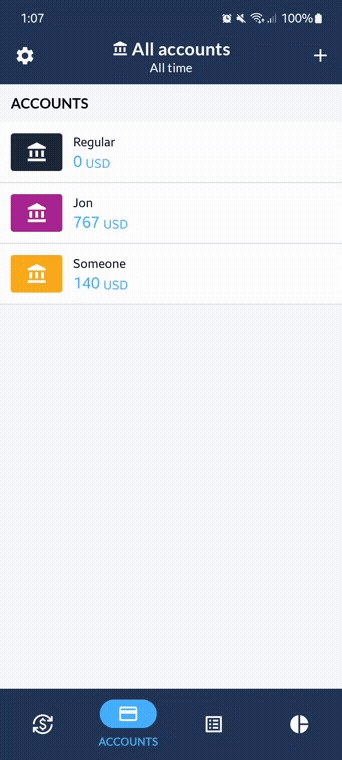  |    |  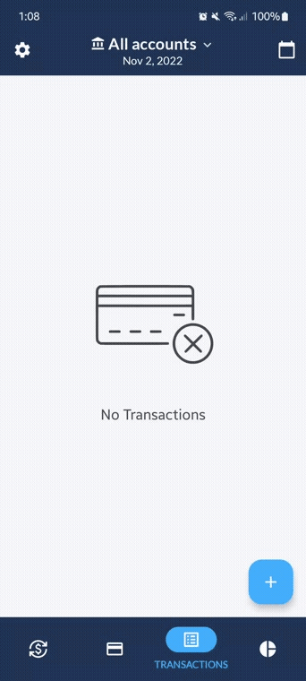  |  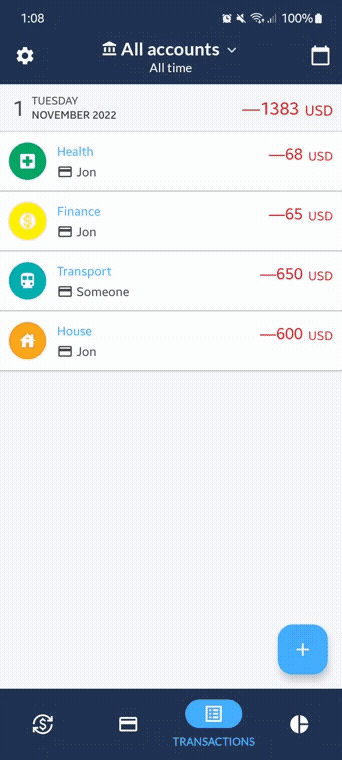

## 📷 Screenshots 📷

This Project uses [**Material 3**](https://m3.material.io/), the latest version of Google's open source design system known as *Material Design*. It also supports [Dark Theme](https://developer.android.com/develop/ui/views/theming/darktheme), as evidenced by the screenshots below:

| Accounts List  | Expenses | Expenses Chart |
| ------------- | ------------- |  ------------- |
| 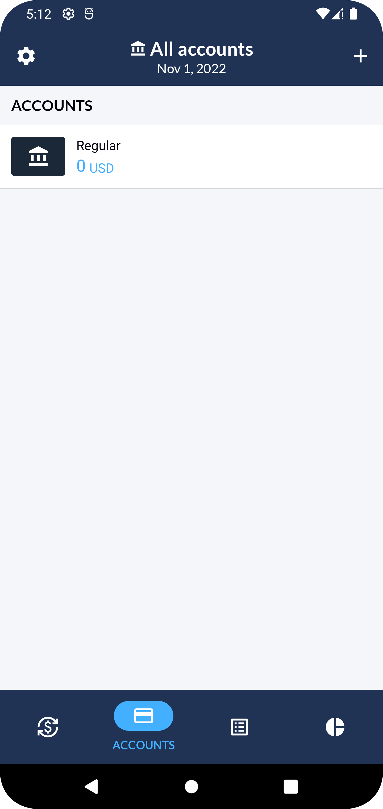  | 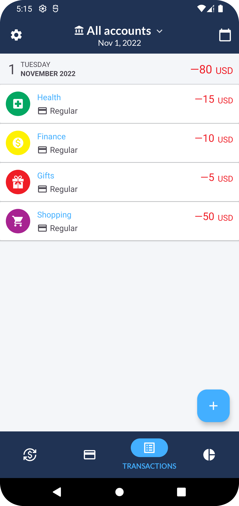  | 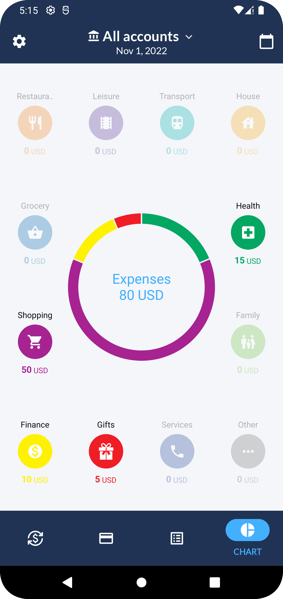  |
|   | 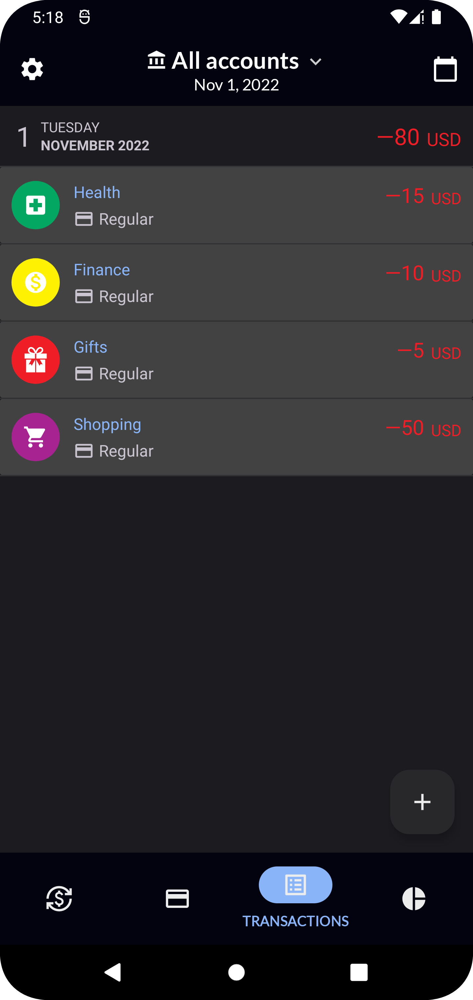  | 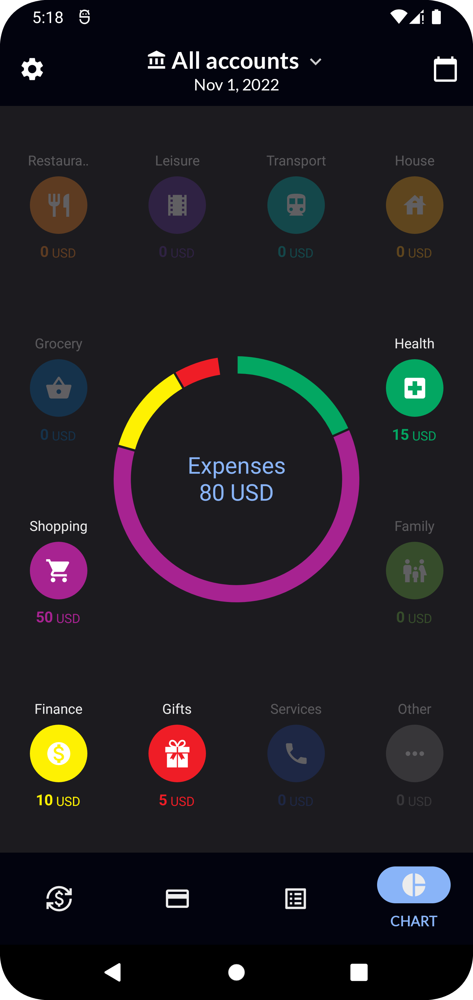  |

| Account Filter  | Date Selector | Settings |
| ------------- | ------------- |  ------------- |
| 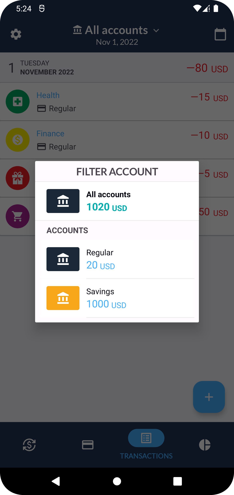  | 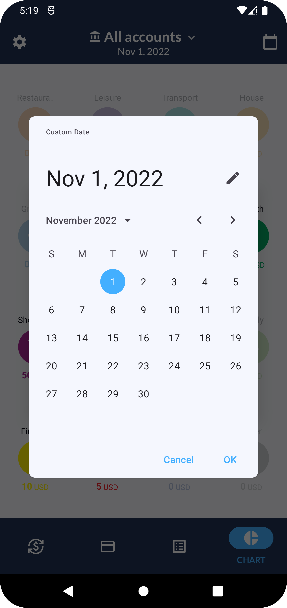  | 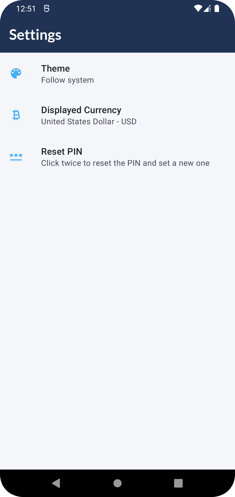  |
| 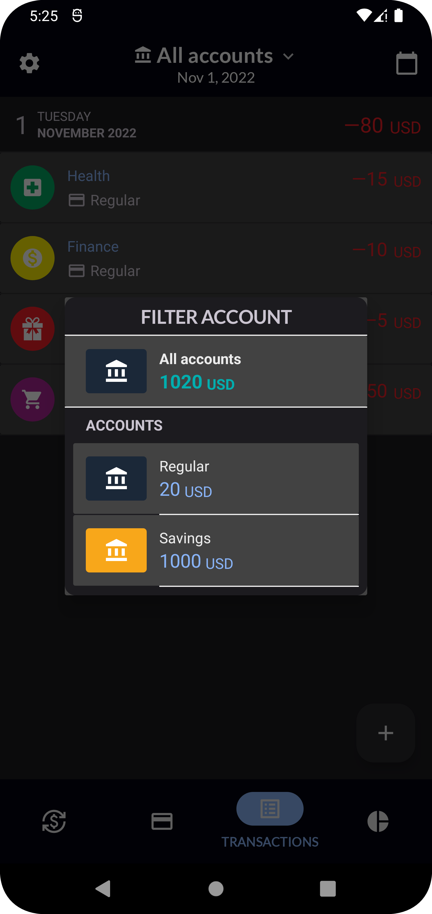  | 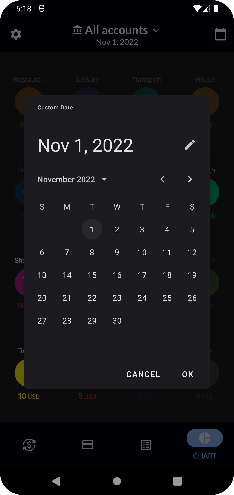  |   |

## 📝 Requirements 📝

This project uses the [Currency API](https://currencyapi.com/) in order to convert currencies.
Hence, in order to run this project it is necessary to specify the API keys in the `local.properties` file, in the following way:
```groovy
CURRENCY_API_KEY = "ReplaceThisForYourApiKey"
```
These fields are later on read in order to generate `BuildConfig` fields in the code, in the `build.gradle.kts` file from the App Module, in the following way:
```kotlin
// Read CURRENCY_API_TOKEN key from local.properties
val currencyApiToken: String = gradleLocalProperties(rootDir).getProperty(currencyApiKey)
buildConfigField("String", currencyApiKey, currencyApiToken)
```

For more information, feel free to [visit the website](https://currencyapi.com/).

## 🛠 Architecture 🛠

The architecture used in this project is that of Clean Architecture, sticking to the following layers:

**1. Presentation:** It's the layer that interacts with the UI. In the Android ecosystem, this refers to Activities, Fragments and their respective ViewModels.

**2. Domain:** Contains the business logic of the application, composed primarily by the Use Cases and the Domain Model.

**3. Data:** Dispenses data to the app, which can be local (SQLLite Database) or remote (API).


## 🦾 Technologies 🦾

This project uses many popular libraries and tools in the Android ecosystem:

* **MPAndroidChart**: A powerful Android data visualization library.
* **Dagger Hilt**: A fully static, compile-time dependency injection framework for both Java and Android.
* **Retrofit**: A type-safe HTTP client.
* **Kotlin Coroutines**: Managing background threads with simplified code and reducing needs for callbacks.
* **Kotlin Flow**: Cold asynchronous data stream that sequentially emits values
* **ROOM**: Persistence Library that provides an abstraction layer over SQLLite to allow for a more robust database access.
* **Shared Preferences**: API for saving a small-collection of key-value pairs.
* **Preferences:**:  Build interactive settings screens, without needing to handle interacting with device storage or managing the user interface.
* **Navigation**: Implement navigation and transactions between fragments.
* **Moshi**: Converts data used by an application to a format that can be transferred over a network or stored in a database or a file.
* **DiffUtil:**  Improving RecyclerView's performance when handling list updates.
* **Lifecycle**: Perform actions in response to a change in the lifecycle status of another component.
* **ViewModel**: Designed to manage and store UI related data in a lifecycle conscious way.
* **ViewBinding**: Allows you to more easily write code that interacts with views.
* **Material 3**: The latest version of Material Design, introduced in Android 12.
* **Material Motion**: A set of transition patterns that can help users understand and navigate an app.

## 🚀 Design Patterns 🚀

Some common Software Design Patterns that can be found in this project and are oftenly used in the Android Ecosystem.

* **Dependency Injection:**: Classes receives other objects that it depends on. This separates the concerns of constructing objects and using objects, which leads to loosely-coupled programs and is a form of *Inversion of Control*.
* **Repository:** Mediates between the domain and data layer using a collection-like interface for accessing domain objects.
* **Domain Model:** An object model of the domain, which incorporates data and behavior.
* **Separated Interface:** Define an interface in a separate package from its implementation. This is done via the repository layers in order to force the data layer to be dependent on the domain layer (*Dependency Inversion*) and follow *Domain Driven Design*.
* **Dependency Inversion:** High level modules should not depend on low level modules.


## 🪶 Author(s) 🪶

**Jon Areas**, [*@jxareas*](https://github.com/jxareas).

"Constantly learning but trying to do things the best I can."

## 📜 License 📜

```
MIT License

Copyright (c) 2022 Jonathan Areas

Permission is hereby granted, free of charge, to any person obtaining a copy
of this software and associated documentation files (the "Software"), to deal
in the Software without restriction, including without limitation the rights
to use, copy, modify, merge, publish, distribute, sublicense, and/or sell
copies of the Software, and to permit persons to whom the Software is
furnished to do so, subject to the following conditions:

The above copyright notice and this permission notice shall be included in all
copies or substantial portions of the Software.

THE SOFTWARE IS PROVIDED "AS IS", WITHOUT WARRANTY OF ANY KIND, EXPRESS OR
IMPLIED, INCLUDING BUT NOT LIMITED TO THE WARRANTIES OF MERCHANTABILITY,
FITNESS FOR A PARTICULAR PURPOSE AND NONINFRINGEMENT. IN NO EVENT SHALL THE
AUTHORS OR COPYRIGHT HOLDERS BE LIABLE FOR ANY CLAIM, DAMAGES OR OTHER
LIABILITY, WHETHER IN AN ACTION OF CONTRACT, TORT OR OTHERWISE, ARISING FROM,
OUT OF OR IN CONNECTION WITH THE SOFTWARE OR THE USE OR OTHER DEALINGS IN THE
SOFTWARE.
```
