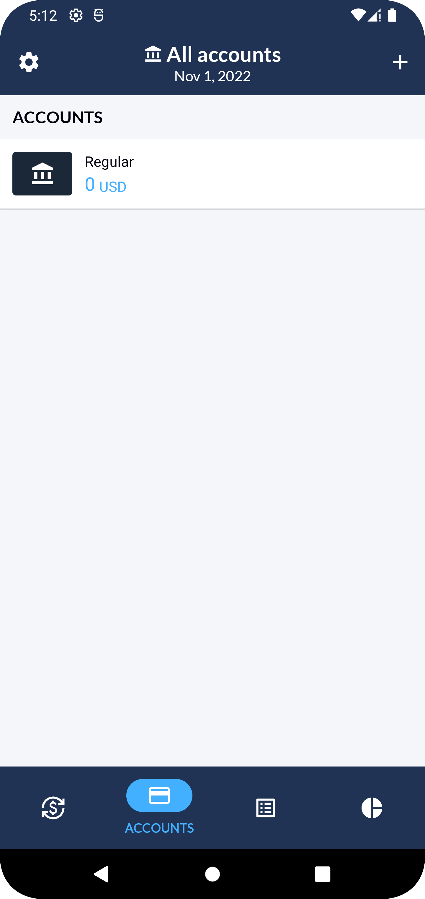
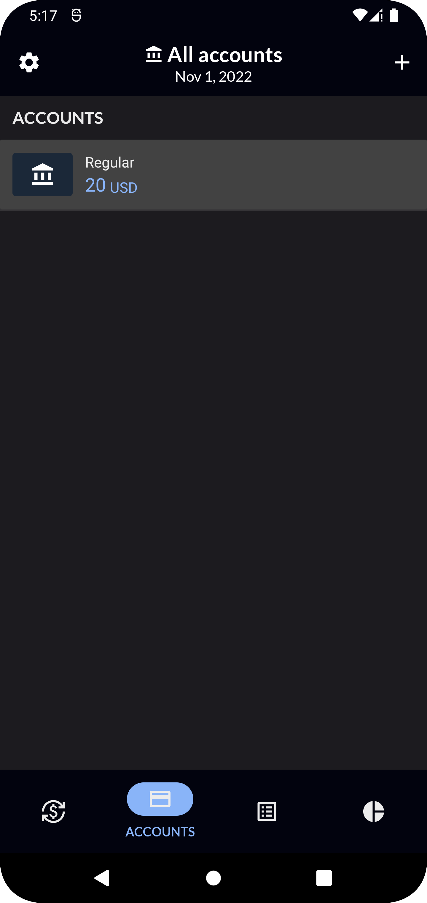
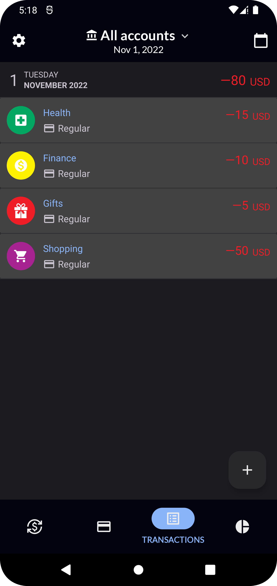
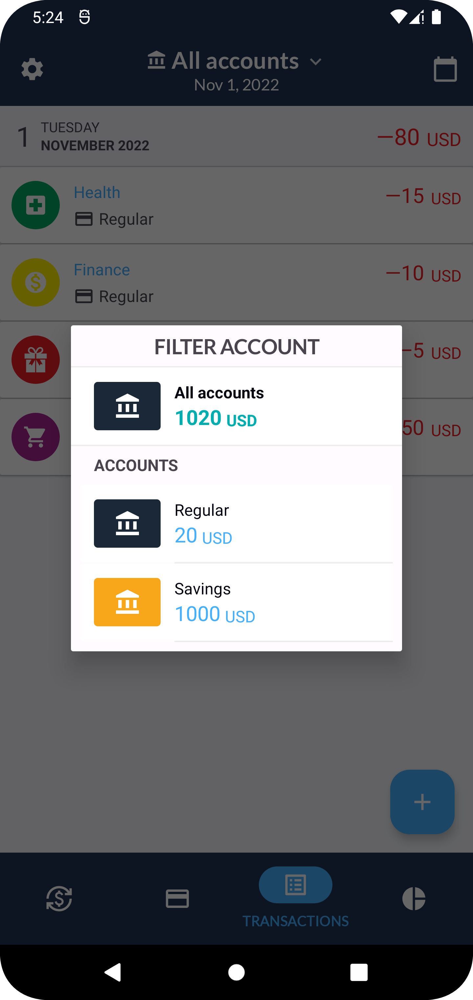
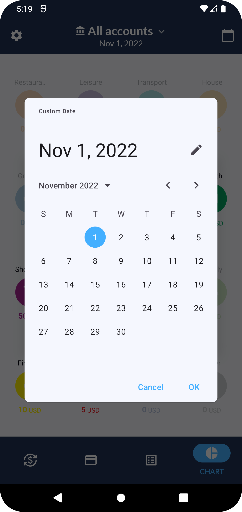
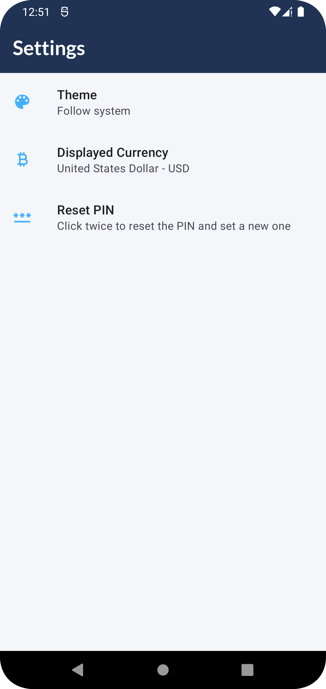
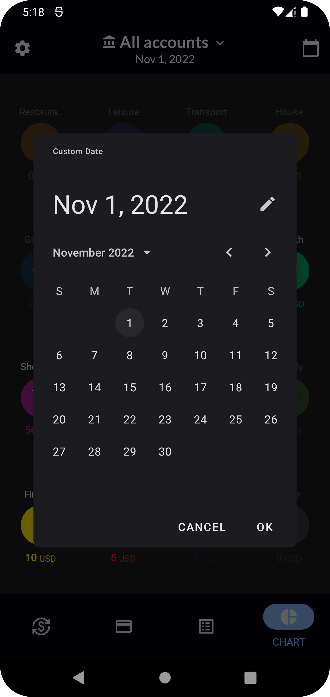
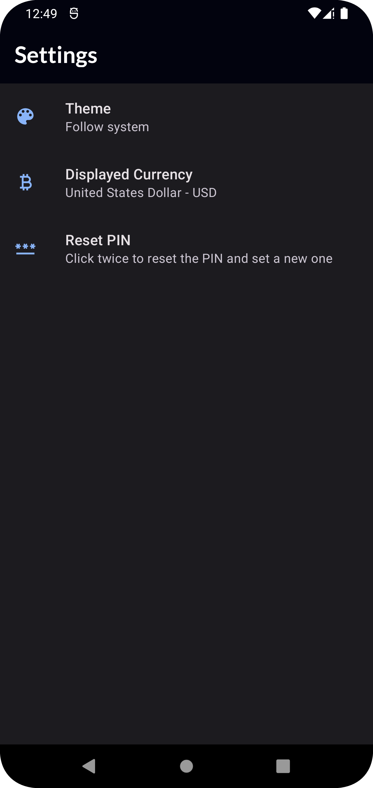

<h1 align = "center">
<b><i>Xpensor</i></b>
</h1>

A Local Expense Tracker App created in order to demonstrate the use of modern Android Development Practices, Android Architecture Components, Material Theming & Animations.

## 📷 Screenshots 📷

| Accounts List  | Expenses | Expenses Chart | 
| ------------- | ------------- |  ------------- |
|   |   |   | 
|   |   |   | 

| Account Filter  | Date Selector | Settings | 
| ------------- | ------------- |  ------------- |
|   |   |   | 
|   |   |   | 

## 🛠 Architecture 🛠

The architecture used in this project is that of Clean Architecture, sticking to the following layers:

**1. Presentation:** It's the layer that interacts with the UI. In the Android ecosystems, this refers to Activities, Fragments and their respectives ViewModels.

**2. Domain:** Contains the business logic of the application, composed primarily by the Use Cases and the Domain Model.

**3. Data:** Dispenses data to the app, which can be local (SQLLite Database) or remote (API).

## ⚙️ Technologies ⚙️

This project uses many popular libraries and tools in the Android ecosystem:

* **MPAndroidChart**: A powerful Android data visualization library.
* **Dagger Hilt**: A fully static, compile-time dependency injection framework for both Java and Android.
* **Retrofit**: A type-safe HTTP client.
* **Kotlin Coroutines**: Managing background threads with simplified code and reducing needs for callbacks.
* **Kotlin Flow**: Cold asynchronous data stream that sequentially emits values
* **ROOM**: Persistence Library that provides an abstraction layer over SQLLite to allow for a more robust database access.
* **Shared Preferences**: API for saving a small-collection of key-value pairs.
* **Preferences:**:  Build interactive settings screens, without needing to handle interacting with device storage or managing the user interface.
* **Navigation**: Implement navigation and transactions between fragments.
* **Moshi**: Converts data used by an application to a format that can be transferred over a network or stored in a database or a file.
* **Lifecycle**: Perform actions in response to a change in the lifecycle status of another component.
* **ViewModel**: Designed to manage and store UI related data in a lifecycle conscious way.
* **ViewBinding**: Allows you to more easily write code that interacts with views.
* **Material 3**: The latest version of Material Design, introduced in Android 12.
* **Material Motion**: A set of transition patterns that can help users understand and navigate an app.

## 🦾 Design Patterns 🦾

Some common Software Design Patterns that can be found in this project and are oftenly used in the Android Ecosystem.

* **Dependency Injection:**: Classes receives other objects that it depends on. This separates the concerns of constructing objects and using objects, which leads to loosely-coupled programs and is a form of *Inversion of Control*.
* **Repository:** Mediates between the domain and data layer using a collection-like interface for accessing domain objects.
* **Domain Model:** An object model of the domain, which incorporates data and behavior.
* **Separated Interface:** Define an interface in a separate package from its implementation. This is done via the repository layers in order to force the data layer to be dependent on the domain layer (*Dependency Inversion*) and follow *Domain Driven Design*.
* **Dependency Inversion:** High level modules should not depend on low level modules. 

## 🪶 Author(s) 🪶

**Jon Areas**, [*@jxareas*](https://github.com/jxareas).

"Constantly learning but trying to do the best I can."
